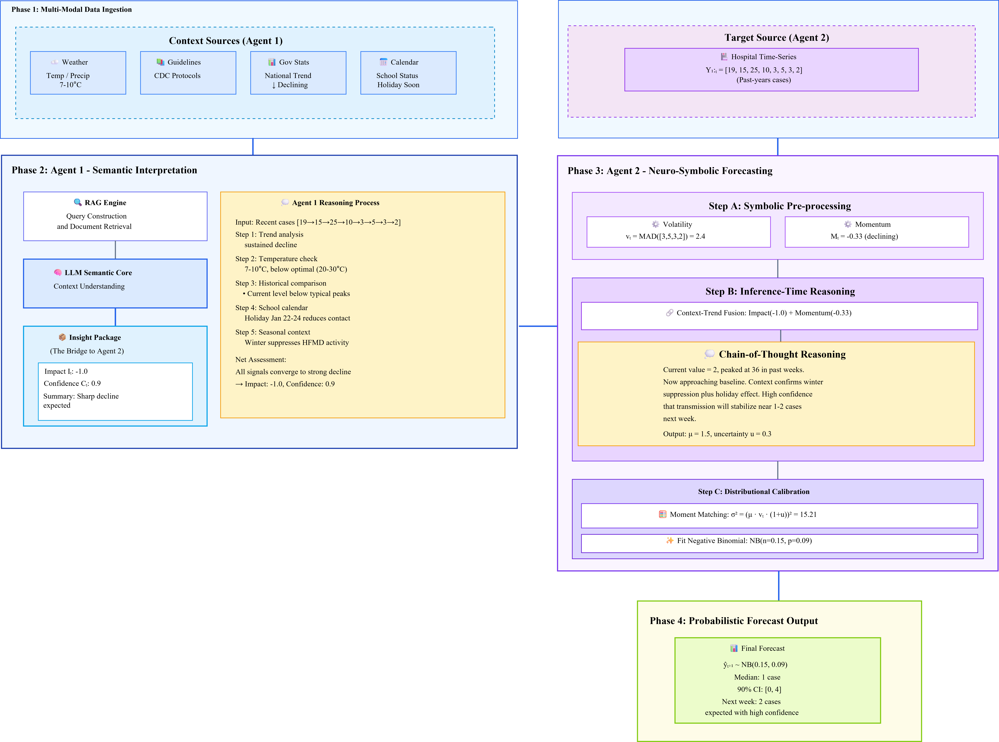

# Beyond Curve Fitting: Neuro-Symbolic Agents for Context-Aware Epidemic Forecasting

[](https://arxiv.org/abs/xxxx.xxxxx)
[](LICENSE)

This repository contains the code for the paper on LLM-based epidemic forecasting. The framework combines Large Language Models with epidemiological context to predict disease case counts.



## 📁 Project Structure

```
forecast_MED/
├── experiments/
│   ├── core/                      # Core forecasting modules
│   │   ├── rolling_agent_forecast.py   # Main rolling forecast pipeline
│   │   ├── simple_event_interpreter.py # Model 1: Event Interpreter
│   │   ├── simple_forecast_generator.py # Model 2: Forecast Generator
│   │   └── llm_agent.py           # LLM API wrapper (OpenAI, DashScope, DeepSeek)
│   ├── configs/
│   │   └── baselines/             # Baseline model configurations
│   │       ├── hk_hfmd/           # Hong Kong HFMD configs
│   │       └── hz_hfmd/           # Li Shui HFMD configs
│   ├── models/                    # Baseline model implementations
│   │   ├── arima_model.py
│   │   ├── prophet_model.py
│   │   ├── lstm_model.py
│   │   ├── xgboost_model.py
│   │   ├── chronos_model.py
│   │   ├── moirai_model.py
│   │   └── timesfm_model.py
│   └── scripts/                   # Utility scripts
├── figure/                        # Paper figures
├── scripts/
│   └── generate_scientific_figures.py  # Figure generation script
└── run_*.sh                       # Experiment runner scripts
```

## 🚀 Quick Start

### 1. Environment Setup

```bash
# Create conda environment
conda create -n epillm python=3.11
conda activate epillm

# Install dependencies
pip install -r requirements.txt

# Set up API keys in .env file
cp .env.example .env
# Edit .env with your API keys
```

### 2. Data Preparation

Prepare your data in CSV format with the following columns:
- `date`: Date in YYYY-MM-DD format
- `cases`: Number of cases (weekly aggregated)

Optional weather data with columns: `date`, `temp_avg`, `temp_max`, `temp_min`, `humidity`, `precipitation`

### 3. Running LLM Experiments

#### Li Shui Hospital Data
```bash
# OpenAI GPT-5.1
python -m experiments.core.rolling_agent_forecast \
  --disease 手足口病 \
  --start 2024-02-01 \
  --end 2024-09-30 \
  --horizon 1 \
  --model gpt-5.1 \
  --provider openai \
  --forecast_mode advanced \
  --save_json \
  --batch advanced_hangzhou_openai

# Qwen3-235b-a22b
python -m experiments.core.rolling_agent_forecast \
  --disease 手足口病 \
  --start 2024-02-01 \
  --end 2024-09-30 \
  --horizon 1 \
  --model qwen3-235b-a22b \
  --provider dashscope \
  --forecast_mode advanced \
  --save_json \
  --batch advanced_hangzhou_qwen

# DeepSeek Chat
python -m experiments.core.rolling_agent_forecast \
  --disease 手足口病 \
  --start 2024-02-01 \
  --end 2024-09-30 \
  --horizon 1 \
  --model deepseek-chat \
  --provider deepseek \
  --forecast_mode advanced \
  --save_json \
  --batch advanced_hangzhou_deepseek
```

#### Hong Kong Public Health Data
```bash
# OpenAI GPT-5.1 (Hong Kong)
python -m experiments.core.rolling_agent_forecast \
  --disease 手足口病 \
  --csv_path path/to/your/data.csv \
  --start 2023-01-01 \
  --end 2024-10-31 \
  --horizon 1 \
  --model gpt-5.1 \
  --provider openai \
  --forecast_mode advanced \
  --save_json \
  --batch advanced_hongkong_openai
```

### 4. Running Baseline Models

```bash
# Run baseline with config file
python -m experiments.run_experiment --config experiments/configs/baselines/hk_hfmd/arima.yaml --batch my_baseline
python -m experiments.run_experiment --config experiments/configs/baselines/hk_hfmd/prophet.yaml --batch my_baseline
python -m experiments.run_experiment --config experiments/configs/baselines/hk_hfmd/lstm.yaml --batch my_baseline
python -m experiments.run_experiment --config experiments/configs/baselines/hk_hfmd/xgboost.yaml --batch my_baseline
python -m experiments.run_experiment --config experiments/configs/baselines/hk_hfmd/chronos.yaml --batch my_baseline
python -m experiments.run_experiment --config experiments/configs/baselines/hk_hfmd/moirai.yaml --batch my_baseline
python -m experiments.run_experiment --config experiments/configs/baselines/hk_hfmd/timesfm.yaml --batch my_baseline
```

### 5. Generating Publication Figures

```bash
# Generate all scientific figures (600 DPI)
python scripts/generate_scientific_figures.py
```

Output structure:
- `*_forecast.png` - Prediction vs Actual with 90% PI
- `*_residuals_overtime.png` - Residual time series
- `*_residuals_distribution.png` - Residual distribution with μ, σ
- `*_composite.png` - Combined A-B-C panel figure

## 📊 Experiment Results

### Hong Kong HFMD (2023-01 ~ 2024-10)

| Model | MAE | CRPS | Coverage_90 |
|-------|-----|------|-------------|
| **OpenAI GPT-5.1** | **3.49** | 2.08 | 87.9% |
| Qwen3-235b-a22b | 3.95 | 2.33 | 91.2% |
| DeepSeek Chat | 4.32 | 2.40 | 90.1% |
| Prophet | 3.49 | 2.31 | 40.0% |
| XGBoost | 3.49 | 2.53 | 33.7% |
| ARIMA | 3.51 | 2.54 | 32.6% |
| LSTM | 3.53 | 1.79 | 73.7% |
| TimesFM | 3.67 | 2.44 | 85.9% |
| Chronos | 3.79 | 1.71 | 56.8% |
| Moirai | 3.95 | 1.86 | 83.2% |

### Li Shui Hospital HFMD (2024-02 ~ 2024-09)

| Model | MAE | CRPS | Coverage_90 |
|-------|-----|------|-------------|
| **OpenAI GPT-5.1** | **4.42** | 2.53 | 84.8% |
| Qwen3-235b-a22b | 4.73 | 2.55 | 90.9% |
| DeepSeek Chat | 4.79 | 2.81 | 93.9% |

## 🔧 Key Parameters

### LLM Forecast Arguments

| Parameter | Description | Default |
|-----------|-------------|---------|
| `--disease` | Disease name (手足口病, 扁桃体炎) | Required |
| `--csv_path` | Custom data file path | Auto-detect |
| `--start` | Forecast start date (YYYY-MM-DD) | Required |
| `--end` | Forecast end date (YYYY-MM-DD) | Required |
| `--horizon` | Forecast horizon in weeks | 1 |
| `--model` | LLM model name | Required |
| `--provider` | API provider (openai, dashscope, deepseek) | Required |
| `--temperature` | LLM temperature | 0.2 |
| `--forecast_mode` | Mode: 'advanced' (full pipeline) or 'baseline' | advanced |
| `--skip_model1` | Skip Event Interpreter (Model 1) | False |
| `--save_json` | Save detailed JSON logs | False |
| `--batch` | Batch name for result directory | Required |

### Baseline Config (YAML)

```yaml
data:
  source: "path/to/data.csv"
  train_start: "2010-01-02"
  train_end: "2022-12-31"
  test_start: "2023-01-07"
  test_end: "2024-10-31"
  rolling:
    enabled: true
    step_size: 1
    forecast_start: "2023-01-07"
    forecast_end: "2024-10-31"

model:
  type: "chronos"  # arima, prophet, lstm, xgboost, chronos, moirai, timesfm
  forecast:
    horizon: 1
```

## 📈 Metrics

- **MAE**: Mean Absolute Error
- **RMSE**: Root Mean Squared Error  
- **CRPS**: Continuous Ranked Probability Score (probabilistic accuracy)
- **Coverage_90**: Proportion of actuals within 90% prediction interval

### CRPS Calculation

For Negative Binomial distribution:
```python
# Variance: Var = μ + μ²/r (where r = dispersion parameter)
std = np.sqrt(pred * (1 + pred / r_nb))
crps = properscoring.crps_gaussian(actual, pred, std)
```

## 📂 Output Structure

```
experiments/results/{batch_name}/
├── simplified______{start}_{end}_v1/
│   ├── predictions.csv      # Predictions with quantiles
│   ├── summary.json         # Metrics summary
│   ├── args.json            # Experiment arguments
│   └── plots/               # Auto-generated plots
└── ...

results_json/{batch_name}/
└── {batch}_{model}_{start}_{end}_{timestamp}.json  # Detailed LLM traces
```

## 📚 Citation

```bibtex
@article{epilllm2025,
  title={Beyond Curve Fitting: Neuro-Symbolic Agents for Context-Aware Epidemic Forecasting},
  author={...},
  journal={...},
  year={2025}
}
```

## 📝 License

This project is licensed under the MIT License - see the [LICENSE](LICENSE) file for details.
