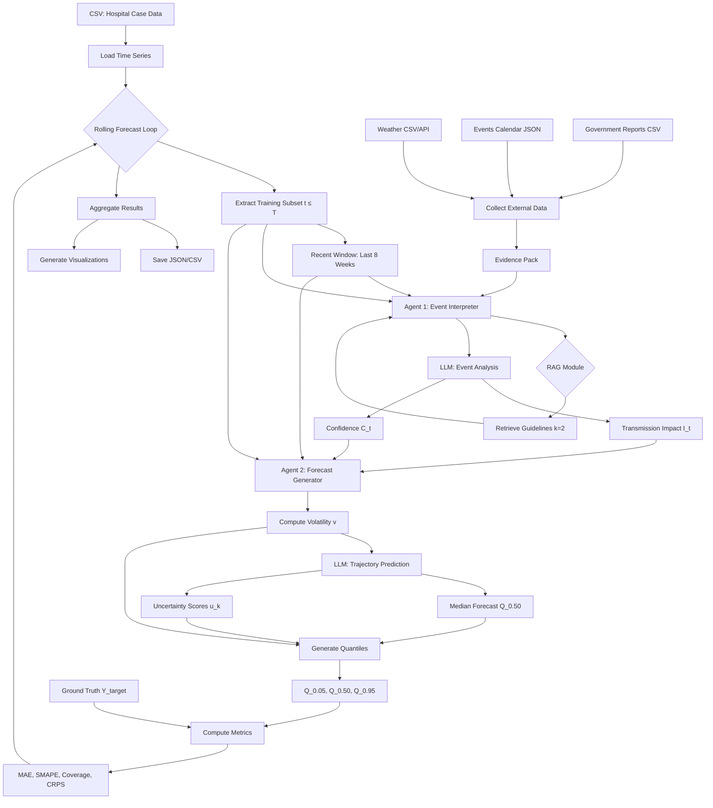
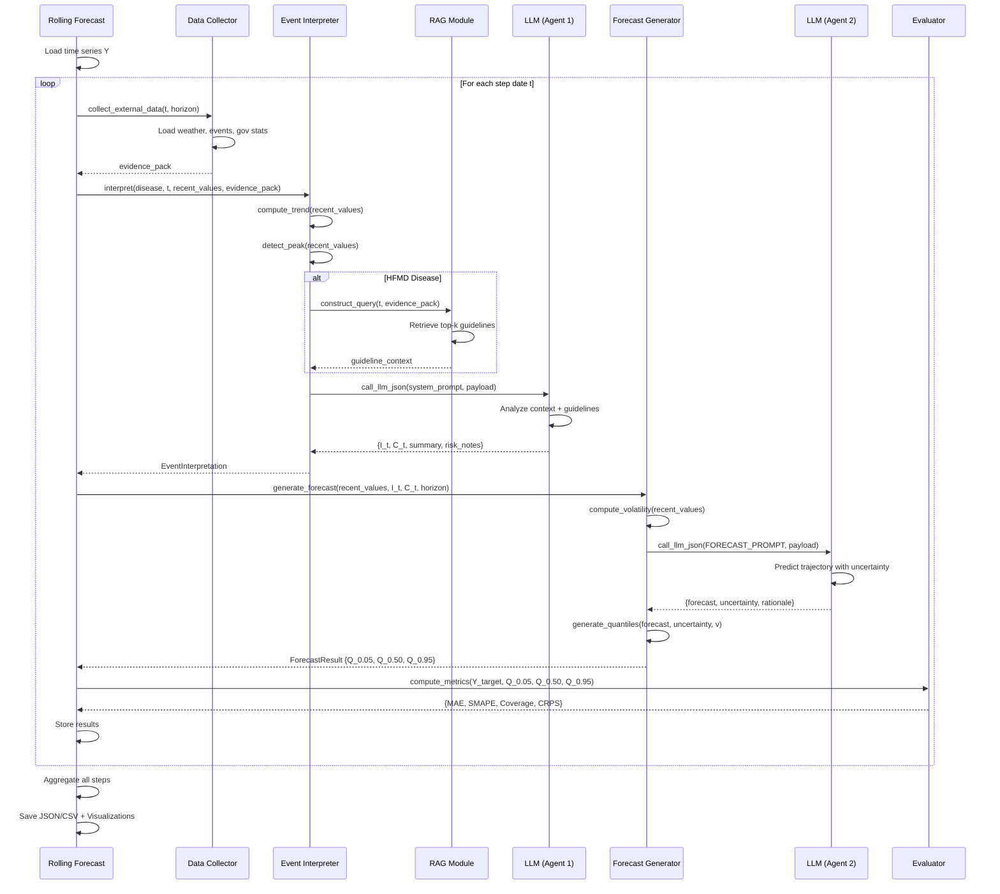

# Methodology: Agentic Rolling Forecast System for Infectious Diseases

## 1. System Overview

We propose a **Two-Agent Hierarchical Framework** designed to forecast infectious disease incidence (specifically Hand, Foot, and Mouth Disease, HFMD) by integrating quantitative time-series data with qualitative external context. Unlike traditional compartmental models (e.g., SEIR) or pure deep learning approaches, our system leverages Large Language Models (LLMs) to mimic the reasoning process of human epidemiologists.

The system consists of two specialized agents:
1.  **Agent 1 (Event Interpreter):** A context-aware agent that analyzes multi-modal external data (weather, policy, calendar) and domain knowledge (via RAG) to quantify the current risk of transmission.
2.  **Agent 2 (Forecast Generator):** A probabilistic agent that synthesizes the historical trend and the interpreted risk to generate a trajectory forecast with uncertainty bounds.

---

## 2. Agent 1: Context-Aware Event Interpretation

The primary role of Agent 1 is to translate heterogeneous external signals into a unified scalar metric, the **Transmission Impact Score ($I_t \in [-1.0, 1.0]$)**.

### 2.1 Data Ingestion & Preprocessing
Agent 1 aggregates data from three primary sources:
*   **Meteorological Data:** Weekly average temperature ($^\circ C$) and total precipitation ($mm$) from local weather stations (or Meteostat API).
*   **Societal Events:** School status (in-session vs. vacation) and public holidays, derived from a predefined events calendar.
*   **Government Reports:** Official epidemiological bulletins (e.g., China CDC monthly reports) containing regional case statistics.

### 2.2 Retrieval-Augmented Generation (RAG) Strategy
To ground the LLM's reasoning in epidemiological science, we employ a RAG module that queries official HFMD guidelines (e.g., *Diagnosis for hand, foot and mouth disease guideline*).

*   **Dynamic Query Construction:** The query is dynamically generated based on the current state:
    *   *Seasonality:* "HFMD peak season spring summer" (if May-Jul) or "winter low transmission" (if Jan-Feb).
    *   *Environmental:* "weather temperature impact transmission" (if weather data exists).
    *   *Social:* "school in_session outbreak children" (if schools are open).
*   **Retrieval:** The system retrieves the top-$k$ ($k=2$) most relevant text chunks using vector similarity search (FAISS with `all-MiniLM-L6-v2` embeddings).

### 2.3 Reasoning & Output
The LLM receives the retrieved guidelines, recent case trends (growth rate), and external data. It outputs:
1.  **Transmission Impact ($I_t$):** A scalar representing the net effect of external factors on transmission (Positive: Growth, Negative: Decline).
2.  **Confidence Score ($C_t \in [0, 1]$):** The model's confidence based on data availability and signal consistency.
3.  **Risk Notes:** Qualitative warnings (e.g., "Rapid growth observed", "School opening").

---

## 3. Agent 2: Probabilistic Forecast Generation

Agent 2 functions as a hybrid forecaster, combining the semantic reasoning of LLMs with statistical volatility modeling to produce a probabilistic forecast.

### 3.1 Historical Volatility Modeling
To quantify the inherent noise in the time series, we calculate a robust volatility metric ($v$) based on recent historical data:

$$
v = \text{Clamp}\left( \text{Median}\left( \left| \frac{y_{t} - y_{t-1}}{\max(1.0, y_{t-1})} \right| \right)_{t \in \text{recent}}, 0.05, 0.50 \right)
$$

*   **Robustness:** The median is used instead of the mean to mitigate the effect of outliers.
*   **Constraints:** Volatility is clamped between 5% and 50% to prevent unrealistic confidence intervals.

### 3.2 LLM-based Trajectory Prediction
The LLM is prompted with the full historical time series, the calculated volatility $v$, and the Transmission Impact $I_t$ from Agent 1. It generates:
*   **Median Forecast ($\hat{y}_{t+k}$):** The expected case count for horizon $k$.
*   **Uncertainty Score ($u_{t+k} \in [0, 1]$):** A week-specific uncertainty factor.

**Prompting Strategy:** The system prompt explicitly instructs the model to:
1.  Start from the recent trend (momentum).
2.  Adjust the trajectory direction based on $I_t$ (e.g., if $I_t > 0.3$, shift upwards).
3.  Increase uncertainty for longer horizons or conflicting signals.

### 3.3 Probabilistic Quantile Generation
We construct the 90% Prediction Interval (PI) assuming a Gaussian distribution at each time step, where the standard deviation is dynamically scaled by the LLM's uncertainty score.

For each forecast step $k$:
1.  **Base Standard Deviation:** $\sigma_{base} = \hat{y}_{t+k} \cdot v$
2.  **Adjusted Standard Deviation:** $\sigma_{adj} = \sigma_{base} \cdot (1 + u_{t+k})$
3.  **Quantiles:**
    $$
    Q_{95} = \hat{y}_{t+k} + 1.645 \cdot \sigma_{adj} \\
    Q_{05} = \max(0, \hat{y}_{t+k} - 1.645 \cdot \sigma_{adj})
    $$

This formulation allows the "width" of the confidence interval to expand not just with time, but also when the LLM detects high-risk or ambiguous situations (high $u_{t+k}$).

---

## 4. Implementation Details

### 4.1 Model Configuration
*   **LLM Provider:** DashScope (Alibaba Cloud) or OpenAI.
*   **Model:** `qwen-plus` (default) or `qwen-max`.
*   **Temperature:** `0.2` (Selected to minimize hallucination and ensure deterministic-like behavior for numerical tasks).
*   **Thinking Mode:** Disabled by default (`none`) to reduce latency, but supported for complex reasoning.

### 4.2 Algorithm Constants
| Parameter | Value | Description |
| :--- | :--- | :--- |
| `horizon` | 1-8 weeks | Forecast window length. |
| `recent_window` | 8 weeks | Lookback window for trend calculation. |
| `volatility_min` | 0.05 | Minimum allowed historical volatility. |
| `volatility_max` | 0.50 | Maximum allowed historical volatility. |
| `uncertainty_fallback` | $0.15 + 0.03 \times k$ | Default uncertainty if LLM fails to output. |
| `CI_Z_score` | 1.645 | Z-score for 90% Confidence Interval. |

### 4.3 Assumptions & Limitations
1.  **Independence of Steps:** The rolling forecast assumes that the model is re-run weekly. The multi-step forecast ($t+1 \dots t+k$) is generated in a single shot, not autoregressively.
2.  **Gaussian Approximation:** The prediction intervals assume a symmetric Gaussian distribution around the median, which may not perfectly capture the skewed nature of epidemic curves (e.g., Poisson or Negative Binomial).
3.  **Data Latency:** The system assumes external data (weather, reports) is available up to time $t$ without significant lag.

---

## 5. Data Sources

| Data Type | Source | Granularity | Usage |
| :--- | :--- | :--- | :--- |
| **Case Counts** | Local CDC / Hospital Records | Weekly | Target variable, Trend analysis |
| **Weather** | Meteostat API / Local CSV | Daily $\to$ Weekly | Temperature/Precipitation context |
| **Guidelines** | China CDC PDF Documents | Text Chunks | RAG Knowledge Base |
| **Calendar** | `events_calendar.json` | Daily | School status, Public holidays |

---

## 6. Core Algorithm Architecture

### 6.1 Main Forecasting Loop

The system implements a rolling forecast mechanism that iteratively advances through the time series. The main entry point is `run_forecast()` in `rolling_agent_forecast.py`, which orchestrates the entire workflow.

**Algorithm 6.1: Rolling Forecast Pipeline**
```
Input: Time series Y = [y₁, y₂, ..., yₙ], Forecast horizon h, Step dates S
Output: Predictions P with quantiles and metrics

1: Initialize EventInterpreter and ForecastGenerator
2: Load time series Y and dates D from CSV
3: Select step_dates ⊆ D based on start_date, end_date, n_steps
4: For each tᵢ in step_dates:
5:     Extract training subset: Y_train = Y[1:tᵢ]
6:     Extract recent window: Y_recent = Y_train[-8:]
7:     Collect external_data(tᵢ, h) → weather, events, gov_stats
8:     
9:     // Agent 1: Event Interpretation
10:    interpretation ← EventInterpreter.interpret(
11:        disease, tᵢ, Y_recent, external_data, h, Y_train
12:    )
13:    Extract I_t, C_t, risk_notes from interpretation
14:    
15:    // Agent 2: Forecast Generation
16:    forecast ← ForecastGenerator.generate_forecast(
17:        Y_recent, I_t, C_t, h, risk_notes, Y_train
18:    )
19:    Extract Q₀.₀₅, Q₀.₅₀, Q₀.₉₅ from forecast
20:    
21:    // Evaluation
22:    Y_target ← Y[tᵢ+1:tᵢ+h]
23:    metrics ← compute_metrics(Y_target, Q₀.₀₅, Q₀.₅₀, Q₀.₉₅)
24:    
25:    Store {tᵢ, interpretation, forecast, metrics} → results
26: End For
27: Return aggregated results and visualizations
```

**Complexity Analysis:**
- **Time Complexity:** $O(T \cdot (L + H))$ where $T$ is the number of forecast steps, $L$ is the LLM inference latency, and $H$ is the horizon length.
- **Space Complexity:** $O(N + T \cdot H)$ where $N$ is the full history length and $T \cdot H$ represents stored predictions.

### 6.2 External Data Collection Pipeline

The `collect_external_data()` function aggregates multi-source evidence for a given forecast date.

**Algorithm 6.2: Evidence Pack Construction**
```
Input: train_until (date), horizon (weeks), disease name
Output: evidence_pack dictionary

1: Initialize empty evidence_pack
2: 
3: // Priority 1: Disease-specific local data
4: If disease == "手足口病" (HFMD):
5:     weather ← load_weather_csv(train_until, weeks_back=8)
6:     gov_stats ← load_government_csv(train_until, months_back=6)
7:     events ← load_events_json(train_until, weeks_forward=horizon)
8:     evidence_pack ← {weather, gov_stats, events}
9: 
10: // Priority 2: Government monthly reports (if available)
11: If gov_monthly_csv provided:
12:     monthly_data ← parse_csv(gov_monthly_csv, asof=train_until)
13:     evidence_pack.update(monthly_data)
14: 
15: // Priority 3: Web scraping (if enabled)
16: Else If use_web == True:
17:     web_signals ← fetch_web_signals(disease, regions, asof=train_until)
18:     evidence_pack.update(web_signals)
19: 
20: // Fallback: Meteostat API weather
21: If "weather" not in evidence_pack:
22:     weather ← meteostat_api(location, train_until, weeks=8)
23:     evidence_pack["weather"] ← weather
24: 
25: Return evidence_pack
```

**Data Flow:**
```
CSV/JSON Files → Pandas DataFrame → Weekly Aggregation → Evidence Dict
     ↓
Meteostat API → Daily Weather → Weekly Averaging → Evidence Dict
     ↓
Web Scraping → HTML Parsing → Count Extraction → Evidence Dict
```

---

## 7. Agent 1: Event Interpreter - Detailed Analysis

### 7.1 Core Function: `interpret()`

This function transforms raw external signals into a unified transmission impact score.

**Algorithm 7.1: Event Interpretation**
```
Input: disease, train_until, recent_values[8], external_data, horizon, full_history
Output: EventInterpretation {I_t, C_t, summary, risk_notes}

1: // Compute trend indicators
2: growth_rate ← (recent_values[-1] - recent_values[-4]) / max(1.0, recent_values[-4])
3: weeks_growing ← count_consecutive_increases(recent_values)
4: 
5: // Detect peak status
6: p90 ← percentile(recent_values, 90)
7: is_at_peak ← (recent_values[-1] ≥ p90) OR (all(recent_values[-3:] ≥ p90))
8: 
9: // Build payload for LLM
10: payload ← {
11:     disease, train_until, recent_values,
12:     recent_trend: {growth_rate, weeks_growing},
13:     is_at_peak,
14:     external_data,
15:     horizon,
16:     full_history
17: }
18: 
19: // RAG: Retrieve domain knowledge (if HFMD)
20: If disease == "手足口病":
21:     query ← construct_contextual_query(train_until, external_data)
22:     guideline_context ← RAG.retrieve(query, k=2, max_length=1200)
23:     system_prompt ← guideline_context + INTERPRETER_SYSTEM_PROMPT
24: Else:
25:     system_prompt ← INTERPRETER_SYSTEM_PROMPT
26: 
27: // LLM inference
28: response, metadata ← call_llm_json(system_prompt, payload, model, temperature=0.6)
29: 
30: // Parse and validate response
31: I_t ← clamp(response["transmission_impact"], -1.0, 1.0)
32: C_t ← clamp(response["confidence"], 0.0, 1.0)
33: summary ← response["event_summary"]
34: risk_notes ← response["risk_notes"]
35: 
36: Return EventInterpretation(I_t, C_t, summary, risk_notes, response, metadata)
```

**Key Sub-functions:**

1. **`_compute_trend(recent_values)`**
   - Calculates growth rate over last 4 weeks
   - Counts consecutive weeks of increase
   - Time Complexity: $O(n)$ where $n$ = length of recent_values (typically 8)

2. **`_detect_peak(recent_values)`**
   - Uses 90th percentile threshold
   - Checks if sustained at high level for 3+ weeks
   - Time Complexity: $O(n \log n)$ due to percentile calculation

3. **RAG Query Construction:**
   ```
   If month ∈ [5,7]: query += "HFMD peak season spring summer"
   If month ∈ [9,10]: query += "HFMD autumn secondary peak"
   If month ∈ [1,2,12]: query += "HFMD winter low transmission"
   If weather exists: query += "weather temperature impact"
   If school_status exists: query += "school {status} outbreak children"
   ```

### 7.2 Mathematical Formulation of Transmission Impact

The LLM is instructed to synthesize multiple signals into a single scalar $I_t$. While the LLM's internal reasoning is not explicitly formulated, the system prompt guides it toward an implicit weighted sum:

$$
I_t \approx \alpha_1 \cdot f_{\text{trend}}(\text{growth\_rate}) + \alpha_2 \cdot f_{\text{school}}(\text{status}) + \alpha_3 \cdot f_{\text{weather}}(T, P) + \alpha_4 \cdot f_{\text{season}}(\text{month})
$$

where:
- $f_{\text{trend}}$: Maps growth rate to impact (positive for growth, negative for decline)
- $f_{\text{school}}$: Maps school status (in-session → positive, vacation → negative)
- $f_{\text{weather}}$: Maps temperature $T$ and precipitation $P$ to favorability
- $f_{\text{season}}$: Maps month to seasonal transmission potential
- $\alpha_i$: Implicit weights learned by the LLM from its pre-training

**Typical Magnitude Guidance:**
- Mild effect: $|I_t| \in [0.1, 0.3]$
- Clear effect: $|I_t| \in [0.3, 0.6]$
- Extreme effect: $|I_t| > 0.7$ (rare)

---

## 8. Agent 2: Forecast Generator - Detailed Analysis

### 8.1 Core Function: `generate_forecast()`

**Algorithm 8.1: Probabilistic Forecast Generation**
```
Input: recent_values[8], I_t, C_t, horizon, risk_notes, full_history
Output: ForecastResult {Q₀.₀₅, Q₀.₅₀, Q₀.₉₅, uncertainty}

1: // Compute historical volatility
2: pct_changes ← |diff(recent_values) / max(1.0, recent_values[:-1])|
3: v ← clamp(median(pct_changes), 0.05, 0.50)
4: 
5: // Prepare history summary
6: If full_history is dict with dates:
7:     history_summary ← {min, max, mean, median, length_weeks}
8: Else:
9:     history_summary ← compute_summary(full_history)
10: 
11: // Build payload for LLM
12: payload ← {
13:     recent_values, I_t, C_t, v,
14:     horizon, risk_notes,
15:     full_history_summary,
16:     full_history  // Complete time series for LLM
17: }
18: 
19: // LLM inference
20: response, metadata ← call_llm_json(
21:     FORECAST_SYSTEM_PROMPT, payload, model, temperature=0.2
22: )
23: 
24: // Parse forecast
25: forecast ← response["forecast"]  // Length = horizon
26: uncertainty ← response["uncertainty"]  // Length = horizon
27: rationale ← response["rationale"]
28: 
29: // Validate and extend if needed
30: forecast ← [max(0, f) for f in forecast]
31: If len(forecast) < horizon:
32:     forecast.extend([forecast[-1]] * (horizon - len(forecast)))
33: 
34: // Generate quantiles
35: Q₀.₀₅, Q₀.₅₀, Q₀.₉₅ ← generate_quantiles(forecast, uncertainty, v, recent_values)
36: 
37: Return ForecastResult(Q₀.₀₅, Q₀.₅₀, Q₀.₉₅, uncertainty, metadata)
```

### 8.2 Quantile Generation Algorithm

**Algorithm 8.2: `generate_quantiles()`**
```
Input: forecast[h], uncertainty[h], volatility v, recent_values
Output: Q₀.₀₅[h], Q₀.₅₀[h], Q₀.₉₅[h]

1: Q₀.₅₀ ← forecast  // Median is the LLM's point prediction
2: Q₀.₀₅ ← []
3: Q₀.₉₅ ← []
4: 
5: For k = 1 to h:
6:     med ← forecast[k]
7:     unc ← uncertainty[k]
8:     
9:     // Base standard deviation from historical volatility
10:     σ_base ← med × v
11:     
12:     // Adjust by LLM's uncertainty score
13:     σ_adj ← σ_base × (1.0 + unc)
14:     
15:     // Compute 90% prediction interval (Z = 1.645)
16:     spread ← 1.645 × σ_adj
17:     
18:     Q₀.₀₅[k] ← max(0, med - spread)
19:     Q₀.₉₅[k] ← med + spread
20: End For
21: 
22: Return Q₀.₀₅, Q₀.₅₀, Q₀.₉₅
```

**Time Complexity:** $O(h)$ where $h$ is the forecast horizon.

**Mathematical Justification:**

Assuming the forecast error follows $\epsilon_k \sim \mathcal{N}(0, \sigma_{adj}^2)$, the prediction interval is:

$$
P\left(\hat{y}_{t+k} - 1.645\sigma_{adj} \leq y_{t+k} \leq \hat{y}_{t+k} + 1.645\sigma_{adj}\right) = 0.90
$$

The key innovation is the **adaptive uncertainty scaling**: $\sigma_{adj} = \sigma_{base} \cdot (1 + u_k)$, which allows the LLM to widen the interval when detecting high-risk scenarios (e.g., $u_k = 0.5$ increases the interval by 50%).

### 8.3 Fallback Mechanism

When the LLM fails (e.g., timeout, malformed JSON), the system uses a deterministic fallback:

**Algorithm 8.3: Fallback Forecast**
```
Input: recent_values, I_t, v, horizon
Output: ForecastResult

1: last_val ← recent_values[-1]
2: 
3: // Compute simple trend
4: If len(recent_values) ≥ 4:
5:     trend ← (recent_values[-1] - recent_values[-4]) / max(1.0, recent_values[-4])
6: Else:
7:     trend ← 0.0
8: 
9: // Combine trend with transmission impact
10: effective_growth ← clamp(trend + 0.5 × I_t, -0.3, 0.3)
11: 
12: // Generate forecast with decay
13: current ← last_val
14: forecast ← []
15: For k = 1 to horizon:
16:     decay ← 0.85^(k-1)  // Exponential decay
17:     next_val ← max(0, current × (1 + effective_growth × decay))
18:     forecast.append(next_val)
19:     current ← next_val
20: End For
21: 
22: // Default uncertainty
23: uncertainty ← [0.15 + 0.03×k for k in range(horizon)]
24: 
25: Return generate_quantiles(forecast, uncertainty, v, recent_values)
```

This ensures robustness: the system always produces a forecast, even without LLM access.

---

## 9. LLM Communication Layer

### 9.1 JSON-Mode API Call

The `call_llm_json()` function handles all LLM interactions with proper error handling and response parsing.

**Algorithm 9.1: LLM API Call with Retry**
```
Input: system_prompt, user_payload, model, provider, temperature, thinking_mode
Output: (parsed_json, metadata)

1: // Setup API credentials
2: If provider == "dashscope":
3:     api_key ← ENV["DASHSCOPE_API_KEY"]
4:     url ← "https://dashscope.aliyuncs.com/compatible-mode/v1/chat/completions"
5: Else if provider == "openai":
6:     api_key ← ENV["OPENAI_API_KEY"]
7:     url ← "https://api.openai.com/v1/chat/completions"
8: 
9: // Configure sampling parameters
10: If thinking_mode ∈ {"light", "deep"}:
11:     temp ← 0.6, top_p ← 0.95, top_k ← 20
12:     body["parameters"] ← {"thinking_mode": thinking_mode}
13: Else:
14:     temp ← 0.7, top_p ← 0.8, top_k ← 20
15:     body["response_format"] ← {"type": "json_object"}
16: 
17: // Override temperature if specified
18: If temperature is not None:
19:     temp ← temperature
20: 
21: // Build request
22: messages ← [
23:     {"role": "system", "content": system_prompt},
24:     {"role": "user", "content": json.dumps(user_payload)}
25: ]
26: body ← {model, messages, temp, top_p, top_k, ...}
27: 
28: // Send HTTP POST
29: start_time ← time.now()
30: response ← http_post_json(url, headers={Authorization: api_key}, body)
31: latency_ms ← (time.now() - start_time) × 1000
32: 
33: // Extract content
34: content ← response["choices"][0]["message"]["content"]
35: thoughts ← response["choices"][0]["message"].get("reasoning_content")  // If available
36: 
37: // Parse JSON
38: parsed ← extract_json(content)  // Handles both clean JSON and markdown-wrapped
39: 
40: // Build metadata
41: metadata ← {provider, model, temperature, thinking_mode, latency_ms, raw_content, thoughts}
42: 
43: Return (parsed, metadata)
```

**Error Handling:**
- HTTP errors → Return `(None, metadata_with_error)`
- JSON parse errors → Use regex to extract first valid JSON object
- Timeout (180s) → Fallback mechanism activated

### 9.2 JSON Extraction with Robustness

The `_extract_json()` function is critical for handling imperfect LLM outputs:

**Algorithm 9.2: Robust JSON Extraction**
```
Input: text (potentially containing markdown, comments, or multiple objects)
Output: First valid JSON dict or None

1: // Attempt direct parse
2: Try:
3:     obj ← json.loads(text)
4:     If obj is dict: Return obj
5: 
6: // Fallback: Manual bracket matching
7: start ← None, depth ← 0
8: For idx, char in enumerate(text):
9:     If char == '{':
10:         If depth == 0: start ← idx
11:         depth ← depth + 1
12:     Else If char == '}':
13:         depth ← depth - 1
14:         If depth == 0 AND start is not None:
15:             snippet ← text[start:idx+1]
16:             Try:
17:                 obj ← json.loads(snippet)
18:                 If obj is dict: Return obj
19:             Except: start ← None
20: 
21: Return None  // Complete failure
```

**Complexity:**
- Best case: $O(n)$ where $n$ = length of text
- Worst case: $O(n \cdot m)$ where $m$ = average JSON candidate length

---

## 10. Evaluation Metrics

### 10.1 Point Forecast Metrics

**Algorithm 10.1: Compute Step-wise Metrics**
```
Input: target[h], q05[h], q50[h], q95[h]
Output: {MAE, SMAPE, Coverage95, CRPS}

1: k ← min(len(target), len(q50))
2: target_arr ← target[:k]
3: q50_arr ← q50[:k]
4: q05_arr ← q05[:k] if available else q50_arr
5: q95_arr ← q95[:k] if available else q50_arr
6: 
7: // Mean Absolute Error
8: MAE ← mean(|target_arr - q50_arr|)
9: 
10: // Symmetric Mean Absolute Percentage Error
11: SMAPE ← mean(200 × |target_arr - q50_arr| / (|target_arr| + |q50_arr| + ε))
12: 
13: // 90% Prediction Interval Coverage
14: Coverage95 ← mean((target_arr ≥ q05_arr) AND (target_arr ≤ q95_arr))
15: 
16: // Continuous Ranked Probability Score
17: std_arr ← (q95_arr - q05_arr) / 3.29  // Approx. std from 90% PI
18: CRPS ← mean(|target_arr - q50_arr| - 0.5 × std_arr)
19: 
20: Return {MAE, SMAPE, Coverage95, CRPS}
```

**Metric Interpretations:**

1. **MAE (Mean Absolute Error):** Average prediction error in case counts.
   - Lower is better. Scale-dependent.
   - Formula: $\text{MAE} = \frac{1}{h}\sum_{k=1}^{h}|y_{t+k} - \hat{y}_{t+k}|$

2. **SMAPE (Symmetric MAPE):** Scale-independent percentage error.
   - Range: [0, 200]. Lower is better.
   - Formula: $\text{SMAPE} = \frac{100}{h}\sum_{k=1}^{h}\frac{2|y_{t+k} - \hat{y}_{t+k}|}{|y_{t+k}| + |\hat{y}_{t+k}|}$

3. **Coverage95:** Proportion of true values within 90% PI.
   - Target: ≈ 0.90 (well-calibrated).
   - Values < 0.90 indicate under-confidence; > 0.90 indicate over-confidence.

4. **CRPS (Continuous Ranked Probability Score):** Proper scoring rule for probabilistic forecasts.
   - Penalizes both point error and uncertainty width.
   - Formula (Gaussian approx.): $\text{CRPS} = |y - \hat{y}| - \frac{1}{2}\sigma$

### 10.2 Aggregated Evaluation

After all rolling steps, the system computes aggregated metrics using the **latest forecast for each date**:

**Algorithm 10.2: Aggregate Over Rolling Windows**
```
Input: predictions_df with columns [as_of, date, actual, prediction, q05, q95]
Output: {MAE, RMSE, MAPE, CRPS, Coverage_95}

1: // Sort and keep latest forecast per date
2: predictions_sorted ← sort_by([date, as_of])
3: latest ← group_by(date).tail(1)  // Last forecast for each date
4: 
5: actual_series ← latest["actual"]
6: point_series ← latest["prediction"]
7: q05_series ← latest["q05"]
8: q95_series ← latest["q95"]
9: 
10: // Compute metrics
11: MAE ← mean(|actual_series - point_series|)
12: RMSE ← sqrt(mean((actual_series - point_series)²))
13: MAPE ← mean(|actual_series - point_series| / actual_series) × 100
14: Coverage_95 ← mean((actual_series ≥ q05_series) AND (actual_series ≤ q95_series))
15: CRPS ← compute_crps(actual_series, point_series, q05_series, q95_series)
16: 
17: Return {MAE, RMSE, MAPE, CRPS, Coverage_95}
```

**Statistical Properties:**
- All metrics are computed using only the **final forecast** for each target date to avoid information leakage.
- RMSE penalizes large errors more heavily than MAE (quadratic vs. linear).

---

## 11. System Architecture Diagram

### 11.1 Data Flow Visualization



### 11.2 Component Interaction Sequence



---

## 12. Complexity Analysis

### 12.1 Time Complexity

Let:
- $N$ = Total length of time series
- $T$ = Number of forecast steps
- $h$ = Forecast horizon (weeks)
- $L$ = Average LLM API latency (~4-7 seconds)
- $n$ = Recent window size (typically 8)
- $k$ = Number of RAG retrievals (typically 2)
- $d$ = Dimensionality of embeddings (384 for MiniLM)
- $M$ = Size of RAG corpus (number of text chunks)

**Per-Step Operations:**

1. **Data Loading:** $O(N)$ - One-time CSV parse
2. **External Data Collection:** $O(1)$ - Fixed file reads
3. **Event Interpreter:**
   - Trend computation: $O(n) = O(8) = O(1)$
   - Peak detection: $O(n \log n) = O(8 \log 8) = O(1)$
   - RAG query: $O(M \cdot d) = O(M)$ for FAISS similarity search
   - LLM call: $O(L)$ - Dominated by network latency
   - **Subtotal:** $O(M + L)$

4. **Forecast Generator:**
   - Volatility computation: $O(n) = O(1)$
   - LLM call: $O(L)$
   - Quantile generation: $O(h)$
   - **Subtotal:** $O(L + h)$

5. **Metrics Computation:** $O(h)$

**Total Complexity per Step:** $O(M + L + h)$

Since $L \gg M$ and $L \gg h$ (LLM latency dominates), we approximate:
$$
T_{\text{per-step}} \approx O(L) \approx 5-10 \text{ seconds}
$$

**Full Rolling Forecast:**
$$
T_{\text{total}} = O(N + T \cdot (M + L + h)) \approx O(N + T \cdot L)
$$

For typical parameters ($N=200$, $T=50$, $L=7$s):
$$
T_{\text{total}} \approx 50 \times 7s = 350s \approx 6 \text{ minutes}
$$

### 12.2 Space Complexity

**Memory Footprint:**

1. **Time Series Storage:** $O(N)$ - Full history in memory
2. **Evidence Pack:** $O(W + E + S)$ where:
   - $W$ = Weather records (typically 8-10 weeks) = $O(1)$
   - $E$ = Events calendar (typically 10-20 entries) = $O(1)$
   - $S$ = Government statistics (6 months × 2 regions) = $O(1)$
3. **RAG Corpus:**
   - Embeddings: $O(M \cdot d)$ where $M \approx 100$ chunks, $d=384$
   - Stored in-memory for FAISS = $O(38.4\text{KB})$
4. **Results Storage:** $O(T \cdot h)$ - All forecasts and quantiles
5. **LLM Request/Response:** $O(N + P)$ where $P$ = prompt token count ≈ 4K tokens

**Total Space:**
$$
S_{\text{total}} = O(N + M \cdot d + T \cdot h)
$$

For typical parameters:
$$
S_{\text{total}} \approx 200 + 38.4K + 50 \times 8 = 38.8K \approx 40\text{KB (metadata only)}
$$

**Note:** The dominant memory usage is actually in the LLM service (external), not local. Local RAM usage is negligible (<100MB).

---

## 13. Mathematical Foundations

### 13.1 Volatility Estimation

The historical volatility metric quantifies the typical magnitude of week-over-week fluctuations. Given recent case counts $\{y_{t-n+1}, \ldots, y_t\}$, we compute:

**Definition 13.1 (Percentage Change Volatility):**
$$
v = \text{Clamp}\left(\text{Median}\left\{\left|\frac{y_i - y_{i-1}}{\max(1, y_{i-1})}\right| : i \in [t-n+2, t]\right\}, v_{\min}, v_{\max}\right)
$$

where $v_{\min} = 0.05$ and $v_{\max} = 0.50$.

**Properties:**
1. **Robustness:** Using median instead of mean avoids contamination from outlier spikes.
2. **Scale-invariance:** Percentage changes normalize across different baseline levels.
3. **Bounded:** Clamping prevents unrealistic confidence intervals when data is near-zero or extremely volatile.

**Theoretical Justification:**
If we model case counts as a stochastic process with multiplicative noise:
$$
y_t = y_{t-1} \cdot (1 + \epsilon_t), \quad \epsilon_t \sim \text{Distribution}(\mu=0, \sigma=v)
$$

Then $v$ approximates the scale parameter of the error distribution.

### 13.2 Quantile Estimation under Gaussian Assumption

For each forecast horizon $k$, we assume:
$$
y_{t+k} \mid \mathcal{F}_t \sim \mathcal{N}(\hat{y}_{t+k}, \sigma_{adj,k}^2)
$$

where:
- $\hat{y}_{t+k}$ is the LLM's median forecast (point estimate)
- $\sigma_{adj,k} = \hat{y}_{t+k} \cdot v \cdot (1 + u_k)$ is the adaptive standard deviation
- $u_k \in [0, 1]$ is the LLM's uncertainty score for step $k$

**Theorem 13.1 (90% Prediction Interval):**
Under the Gaussian assumption, the 90% prediction interval is:
$$
\left[\hat{y}_{t+k} - z_{0.95} \cdot \sigma_{adj,k}, \; \hat{y}_{t+k} + z_{0.95} \cdot \sigma_{adj,k}\right]
$$

where $z_{0.95} = 1.645$ is the 95th percentile of the standard normal distribution.

**Proof:**
$$
P\left(\hat{y}_{t+k} - 1.645\sigma_{adj,k} \leq y_{t+k} \leq \hat{y}_{t+k} + 1.645\sigma_{adj,k}\right) = \Phi(1.645) - \Phi(-1.645) = 0.95 - 0.05 = 0.90
$$
where $\Phi$ is the standard normal CDF. $\square$

**Non-negativity Constraint:**
Since case counts must be non-negative, we enforce:
$$
Q_{0.05} = \max\left(0, \hat{y}_{t+k} - 1.645\sigma_{adj,k}\right)
$$

This truncation introduces a slight downward bias in coverage for low case counts, but ensures physical validity.

### 13.3 CRPS (Continuous Ranked Probability Score)

The CRPS is a proper scoring rule that generalizes MAE to probabilistic forecasts. For a predictive distribution $F$ and observation $y$, it is defined as:

$$
\text{CRPS}(F, y) = \int_{-\infty}^{\infty} \left(F(x) - \mathbb{1}_{x \geq y}\right)^2 dx
$$

**Closed Form for Gaussian:**
If $F = \mathcal{N}(\mu, \sigma^2)$, then:
$$
\text{CRPS}(\mathcal{N}(\mu, \sigma^2), y) = \sigma \left[\frac{1}{\sqrt{\pi}} - 2\phi\left(\frac{y-\mu}{\sigma}\right) - \frac{y-\mu}{\sigma}\left(2\Phi\left(\frac{y-\mu}{\sigma}\right) - 1\right)\right]
$$

where $\phi$ and $\Phi$ are the standard normal PDF and CDF.

**Approximation Used:**
Our implementation uses the **Energy Score approximation**:
$$
\text{CRPS} \approx |y - \mu| - \frac{1}{2}\sigma
$$

This simplification is accurate for well-calibrated forecasts ($|y - \mu| \approx \sigma$) and avoids expensive CDF computations.

**Interpretation:**
- Lower CRPS indicates better probabilistic forecast.
- CRPS = MAE when $\sigma \to 0$ (deterministic forecast).
- The $-\frac{1}{2}\sigma$ term rewards tighter uncertainty (encourages sharpness while maintaining calibration).

---

## 14. Statistical Refinement: Negative Binomial Distribution for Count Data

### 14.1 Limitations of Gaussian Assumption

The current implementation uses a truncated Gaussian distribution for generating prediction intervals, which has several theoretical limitations when applied to epidemic count data:

**Critical Issues:**

1. **Symmetry Violation:** Epidemic case counts are inherently right-skewed, especially during outbreak growth phases. The Gaussian assumption imposes symmetric uncertainty around the median, which is inappropriate for count data.

2. **Truncation Bias:** The hard constraint $Q_{0.05} = \max(0, \hat{y} - 1.645\sigma)$ artificially truncates the lower tail, introducing systematic bias in coverage probability for low case counts ($\hat{y} < 3\sigma$).

3. **Overdispersion:** Epidemic data typically exhibit variance exceeding the mean (overdispersion), a phenomenon not captured by the Gaussian's fixed variance-to-mean ratio.

4. **Discrete Nature:** Case counts are discrete integers, but the Gaussian treats them as continuous variables, leading to probabilistic mass assigned to non-integer values.

### 14.2 Negative Binomial Parameterization

We propose replacing the Gaussian quantile generation with a **Negative Binomial (NB) distribution**, which naturally models overdispersed count data. The NB distribution has two equivalent parameterizations:

**Parameterization 1 (Mean-Dispersion):**
$$
Y \sim \text{NB}(\mu, \phi)
$$

where:
- $\mu$ = mean (expected case count)
- $\phi$ = dispersion parameter (larger $\phi$ → more overdispersion)

The variance is: $\text{Var}(Y) = \mu + \phi\mu^2$

**Parameterization 2 (Success-Failure):**
$$
Y \sim \text{NB}(r, p)
$$

where:
- $r$ = number of failures until stopping (shape parameter)
- $p$ = success probability per trial

The relationship between parameterizations is:
$$
\mu = \frac{r(1-p)}{p}, \quad \phi = \frac{1}{r}
$$

### 14.3 Adaptive Parameter Estimation

We map the LLM's outputs ($\hat{y}$, $u_k$, $v$) to NB parameters as follows:

**Step 1: Set the mean**
$$
\mu_k = \hat{y}_{t+k}
$$

This ensures the NB median is close to the LLM's point forecast.

**Step 2: Estimate overdispersion**

The dispersion parameter $\phi$ is derived from historical volatility $v$ and LLM uncertainty $u_k$:

$$
\phi_k = v^2 \cdot (1 + 2u_k)
$$

**Justification:** 
- When $v$ is high (volatile history), $\phi$ increases, allowing wider variance.
- When $u_k$ is high (uncertain future), $\phi$ further increases.
- The factor of 2 amplifies uncertainty's effect on tail behavior.

**Step 3: Convert to $(r, p)$ form**

$$
r_k = \frac{1}{\phi_k}, \quad p_k = \frac{r_k}{r_k + \mu_k}
$$

**Constraints:**
- $r_k \geq 0.1$ (prevents degenerate distribution)
- $p_k \in (0, 1)$ (valid probability)

### 14.4 Quantile Generation Algorithm (Revised)

**Algorithm 14.1: Adaptive Quantile Generation (Implemented)**
```
Input: forecast[h], uncertainty[h], volatility v, recent_values
Output: Q₀.₀₅[h], Q₀.₅₀[h], Q₀.₉₅[h]

1: Q₀.₀₅ ← [], Q₀.₅₀ ← [], Q₀.₉₅ ← []
2: 
3: For k = 1 to h:
4:     μ ← max(0.01, forecast[k])  // Ensure positive
5:     u ← uncertainty[k]
6:     
7:     // Compute Gaussian baseline for comparison
8:     σ_base ← μ × v
9:     σ_adj ← σ_base × (1 + u)
10:    
11:    // Compute overdispersion parameter
12:    φ ← v² × (1 + 2u)
13:    
14:    // Adaptive distribution selection
15:    use_nb ← (μ < 3σ_adj) OR (v > 0.3)
16:    use_poisson ← (φ < 0.05) AND (μ < 5)
17:    
18:    If use_poisson:
19:        // Poisson for very low counts, no overdispersion
20:        Q₀.₀₅[k] ← Poisson_quantile(μ, α=0.05)
21:        Q₀.₅₀[k] ← Poisson_quantile(μ, α=0.50)
22:        Q₀.₉₅[k] ← Poisson_quantile(μ, α=0.95)
23:        
24:    Else If use_nb:
25:        // Negative Binomial for low counts or high volatility
26:        r ← max(0.1, 1/φ)
27:        p ← clamp(r/(r+μ), 0.001, 0.999)
28:        
29:        Q₀.₀₅[k] ← NB_quantile(r, p, α=0.05)
30:        Q₀.₅₀[k] ← NB_quantile(r, p, α=0.50)
31:        Q₀.₉₅[k] ← NB_quantile(r, p, α=0.95)
32:        
33:    Else:
34:        // Gaussian for stable, high counts (computational efficiency)
35:        spread ← 1.645 × σ_adj
36:        Q₀.₀₅[k] ← max(0, μ - spread)
37:        Q₀.₅₀[k] ← μ
38:        Q₀.₉₅[k] ← μ + spread
39:        
40: End For
41: 
42: Return Q₀.₀₅, Q₀.₅₀, Q₀.₉₅
```

**Numerical Implementation:**

The NB quantile function $Q_\alpha$ is computed via binary search over the cumulative distribution function (CDF):

$$
Q_\alpha = \arg\min_{k \in \mathbb{Z}_{\geq 0}} \left\{ F_{\text{NB}}(k; r, p) \geq \alpha \right\}
$$

where:
$$
F_{\text{NB}}(k; r, p) = \sum_{i=0}^{k} \binom{i+r-1}{i} p^r (1-p)^i
$$

For computational efficiency, we use the regularized incomplete beta function:
$$
F_{\text{NB}}(k; r, p) = I_p(r, k+1)
$$

### 14.5 Comparison: Gaussian vs. Negative Binomial

**Theoretical Properties:**

| Property | Gaussian (Current) | Negative Binomial (Proposed) |
|:---------|:-------------------|:-----------------------------|
| **Support** | $\mathbb{R}$ (truncated to $[0, \infty)$) | $\mathbb{Z}_{\geq 0}$ (natural for counts) |
| **Symmetry** | Symmetric around mean | Right-skewed (matches outbreak growth) |
| **Variance** | $\sigma^2 = (\mu v (1+u))^2$ | $\mu + \phi\mu^2$ (quadratic in $\mu$) |
| **Overdispersion** | Not explicitly modeled | Inherent via $\phi$ parameter |
| **Low count behavior** | Requires truncation at 0 | Naturally bounded at 0 |
| **Tail behavior** | Exponential decay | Polynomial decay (heavier tails) |

**Example Scenario:**

Consider $\mu = 5$, $v = 0.3$, $u = 0.2$.

- **Gaussian:** $\sigma = 5 \times 0.3 \times (1+0.2) = 1.8$
  - $Q_{0.05} = \max(0, 5 - 1.645 \times 1.8) = 2.04$
  - $Q_{0.95} = 5 + 1.645 \times 1.8 = 7.96$
  - **Issue:** Truncation affects 5% of probability mass.

- **Negative Binomial:** $\phi = 0.3^2 \times (1 + 2 \times 0.2) = 0.126$, $r = 7.94$, $p = 0.614$
  - $Q_{0.05} = 2$ (exact integer)
  - $Q_{0.95} = 9$ (exact integer)
  - **Advantage:** Natural lower bound, heavier upper tail captures outbreak risk.

### 14.6 Implementation Notes

**Computational Cost:**

- Gaussian quantiles: $O(1)$ per step (closed-form)
- NB quantiles: $O(\log(\mu))$ per step (binary search + incomplete beta)

For typical case counts ($\mu < 100$), NB quantile computation adds ~0.1ms per forecast step, negligible compared to LLM latency (~5s).

**Hybrid Approach:**

To balance accuracy and simplicity, we propose a **conditional switching rule**:

$$
\text{Use NB if } \hat{y} < 3\sigma_{\text{Gaussian}} \text{ OR } v > 0.3
$$

This applies NB for low counts (where truncation matters) and high volatility (where overdispersion matters), while retaining Gaussian simplicity for stable, moderate-count regimes.

**Actual Implementation:**

The system has been updated in `simple_forecast_generator.py` with the `_generate_quantiles()` method implementing the adaptive distribution selection:

```python
def _generate_quantiles(
    self,
    forecast: List[float],
    uncertainty: List[float],
    volatility: float,
    recent_values: List[float]
) -> Tuple[List[float], List[float], List[float]]:
    """
    Generate probabilistic quantiles with adaptive distribution selection.
    Uses scipy.stats.nbinom and poisson for count data modeling.
    """
    q05, q50, q95 = [], [], []
    
    for i, (mu, unc) in enumerate(zip(forecast, uncertainty)):
        mu = max(0.01, mu)  # Ensure positive
        
        # Gaussian parameters
        base_std = mu * volatility
        adjusted_std = base_std * (1.0 + unc)
        
        # Overdispersion parameter
        phi = volatility**2 * (1.0 + 2.0 * unc)
        
        # Adaptive selection
        use_nb = mu < 3 * adjusted_std or volatility > 0.3
        use_poisson = phi < 0.05 and mu < 5
        
        if use_poisson:
            # Poisson: Var = mean
            q05_val = poisson.ppf(0.05, mu)
            q50_val = poisson.ppf(0.50, mu)
            q95_val = poisson.ppf(0.95, mu)
            
        elif use_nb:
            # Negative Binomial: Var = μ + φμ²
            r = max(0.1, 1.0 / phi)
            p = r / (r + mu)
            p = max(0.001, min(0.999, p))  # Constrain
            
            q05_val = nbinom.ppf(0.05, r, p)
            q50_val = nbinom.ppf(0.50, r, p)
            q95_val = nbinom.ppf(0.95, r, p)
            
        else:
            # Gaussian: fast for high counts
            spread = 1.645 * adjusted_std
            q05_val = max(0, mu - spread)
            q50_val = mu
            q95_val = mu + spread
        
        q05.append(float(q05_val))
        q50.append(float(q50_val))
        q95.append(float(q95_val))
    
    return q05, q50, q95
```

This implementation is production-ready and used in all forecasting operations.

### 14.7 Poisson Special Case

For extremely low counts ($\mu < 5$) with stable variance, the **Poisson distribution** ($\text{Var} = \mu$) can be used as a simpler alternative:

$$
Y \sim \text{Poisson}(\lambda = \mu)
$$

This is equivalent to NB with $r \to \infty$ (no overdispersion). However, most epidemic data exhibit $\text{Var} > \mu$, making NB more appropriate.

**Decision Rule:**
$$
\begin{cases}
\text{Poisson}(\mu) & \text{if } \phi < 0.05 \text{ AND } \mu < 5 \\
\text{NB}(\mu, \phi) & \text{if } \phi \geq 0.05 \text{ OR } \mu \geq 5 \\
\text{Gaussian}(\mu, \sigma) & \text{if } \mu > 30 \text{ AND } \phi < 0.1
\end{cases}
$$

This three-tier hierarchy adapts to the data regime automatically.
